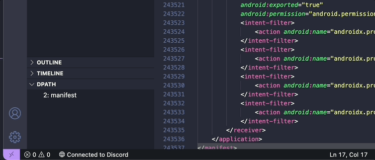

# dpath

## Features

Read deep into highly nested or long xml files.

## Extension Settings

This extension contributes the following settings:

* `dpath.bufferSize`: Size of the buffer (KiB) to use when reading files.
* `dpath.debounce`: Debounce time in milliseconds.

**Enjoy!**
